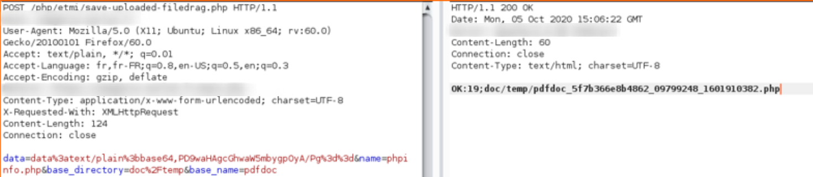
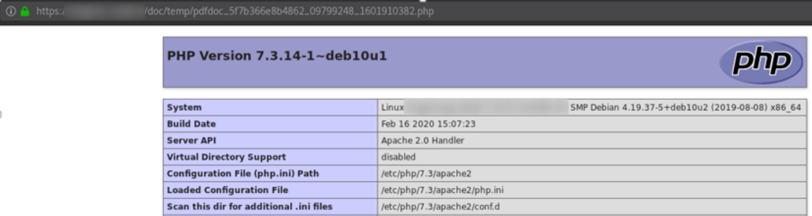
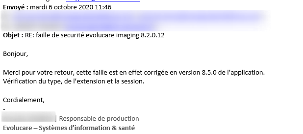

# evolucaire

- evolucaire imaging v8.2.0.12 
 - unrestricted file upload & RCE
 - fixé en version 8.5

- upload unauthenticated sur : 
  - /php/etmi/save-uploaded-filedrag.php
    - data=data:text/plain;base64,<payload_b64>
    - name=phpinfo.php
    - base_directory=doc/temp
    - base_name=pdfdoc

- statut : CVE id affected : CVE-2021-36355

- run :

- Support answer, the vuln is fixed :

