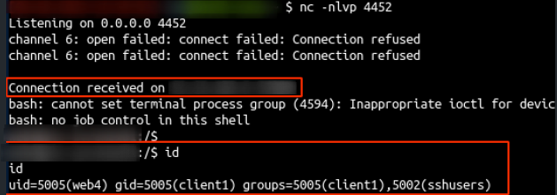
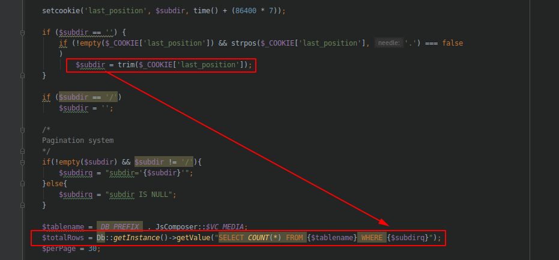
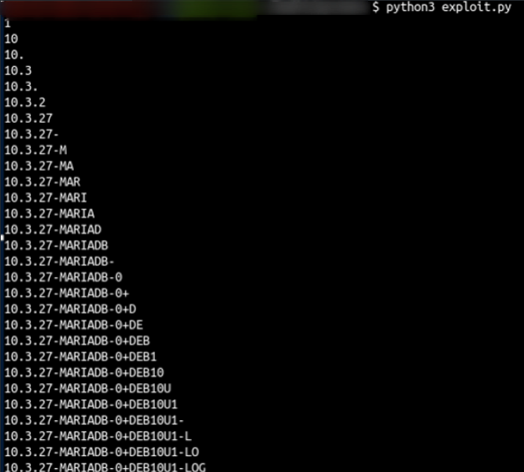

# Module visualcomposer prestashop

Visual composer prestashop module phar RCE

- Check version : /modules/jscomposer/config.xml
- Version < 4.18

- The support answer both vulns are fixed in version 4.18

## PHAR unserialize
- POC : exploit_phar_unserialize.php
  - Image upload with a polymorph gif/phar image (phar file staring with GIF89 and .gif extension) (/modules/jscomposer/views/upload.php)
  - Rename uploads folder (/modules/jscomposer/views/execute.php?action=rename_folder)
  - Call image_size function with a special path variable : 'path' => 'phar://../'.$renamed.'/phar.png/modules/jscomposer/uploads/' (/modules/jscomposer/views/ajax_calls.php?action=image_size)
  - This call the phar wrapper to the uploaded image. This trig the unserialize on a gadget based on monolog.

- Run :

## SQLI
- boolean based SQLI in the cookie last_position

- POC: exploit_sqli.py

- Code : 

- Run :

